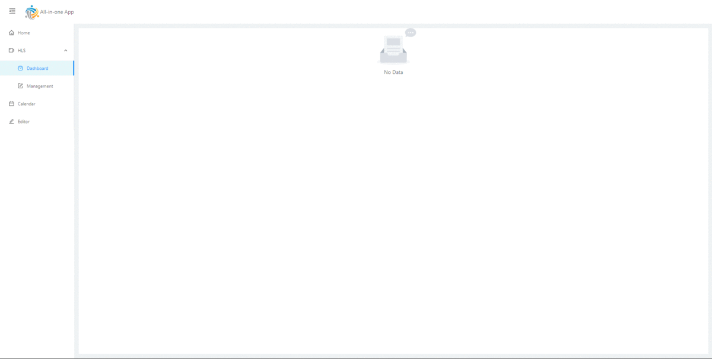

# AIO APP


This project use for personal usage of any development at frontend app. Merely, If i wanna start new project, i must be use this app.



## Usage

Clone repository with one of the following ways and start coding.

with HTTPS:

```shell
git clone https://github.com/furkanyilmazx/aio-app.git
```

with SSH:

```shell
git clone git@github.com:furkanyilmazx/aio-app.git
```
## Install
```shell
npm i
```
## Development
```shell
npm start
```

## Build
```shell
npm run build
```

## Deployment

### Build as Docker image
```shell
docker build --rm -t aio-app .
```
### Run as a Docker container
```shell
docker run -di --name aio-app -p 8888:80 aio-app
```
> You can use app over 8888 port or what do you want

